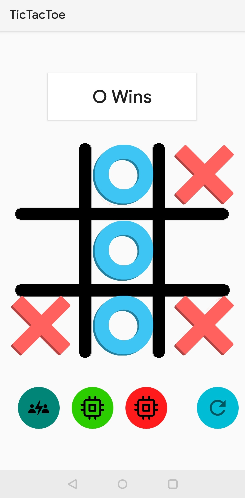

# TicTacToeAndroid
Simple Android TicTacToe game made using code from https://github.com/Setomaster/TicTacToe

4 buttons at the bottom are to control the game mode and reseting the current game: PVP, player vs random computer player, player vs perfect computer player and restart button respectively.

Sreenshots

Instance where O wins

Instance of a draw

